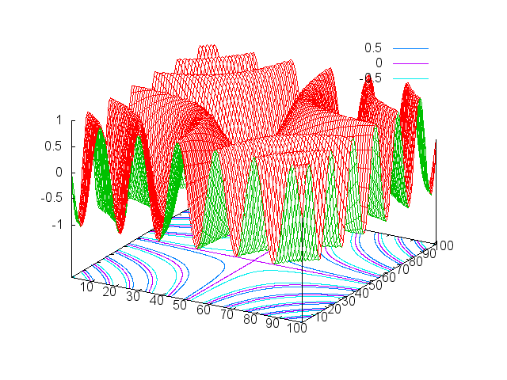

<a name="gnuplot.surface.dok"></a>
## Plotting 3D Surfaces ##

Surface plotting creates a 3D surface plot of a given matrix `z`. Entries
of `z` are used as height values. It is also possible to specify `x` and
`y` locations corresponding to each point in `z` . If a terminal with
interactive capabilities is being used by `Gnuplot` backend (like `x11` or
`wxt` or `qt`), then rotating, zooming is also possible.

<a name="gnuplot.splot"></a>
### gnuplot.splot(z) ###

Plot surface ` z ` in 3D.
```lua
x = torch.linspace(-1,1)
xx = torch.Tensor(x:size(1),x:size(1)):zero():addr(1,x,x)
xx = xx*math.pi*6
gnuplot.splot(torch.sin(xx))
```


It is also possible to specify the `x` and `y` locations of each
point in `z` by `gnuplot.splot(x,y,z)`. In this `x` and `y` has
to be the same shape as `z`.

One can also display multiple surfaces at a time.

```lua
x = torch.linspace(-1,1)
xx = torch.Tensor(x:size(1),x:size(1)):zero():addr(1,x,x)
xx = xx*math.pi*2
gnuplot.splot({torch.sin(xx)},{torch.sin(xx)+2})
```

